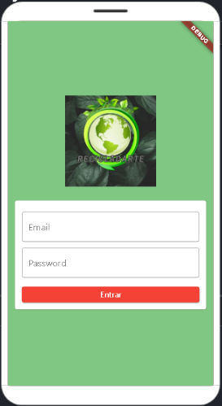
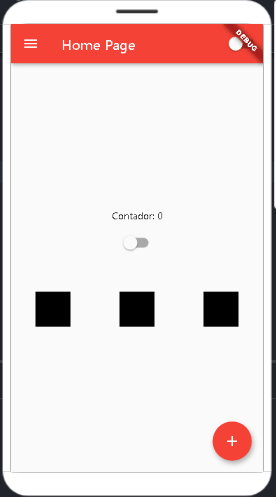
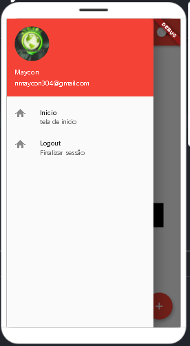

# Primeira parte do curso - Hello World

## Getting Started

* Esta é a primeira parte do curso;
* Voltado para Layout, exemplo de Login, Drawer e detalhes de layout;
* Estou usando a plataforma FlutLab.io que permite criar o projeto e emular direto na plataforma pelo no navegador;

- [FlutLab.io](https://flutlab.io/)
- [Curso flutterando em questão YouTube](https://www.youtube.com/watch?v=XeUiJJN0vsE&list=PLlBnICoI-g-d-J57QIz6Tx5xtUDGQdBFB&ab_channel=Flutterando)

